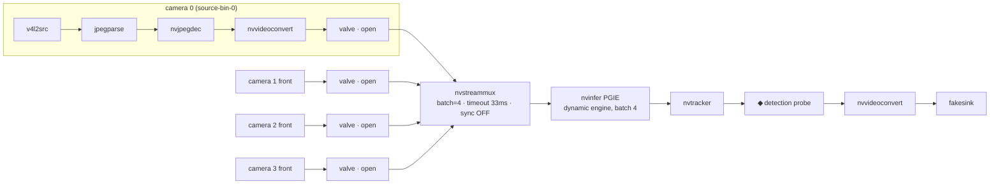
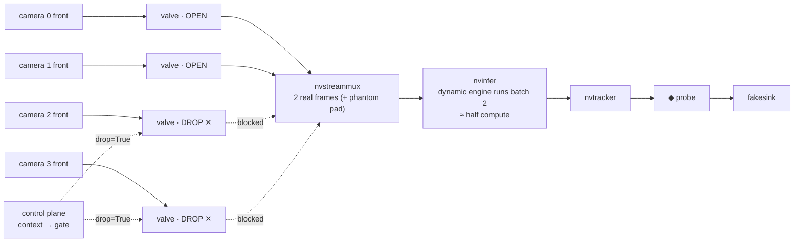
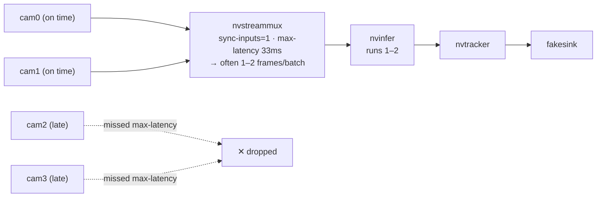
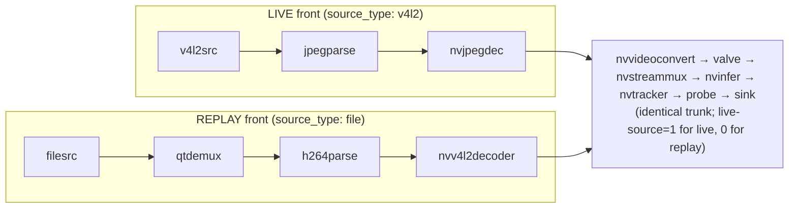
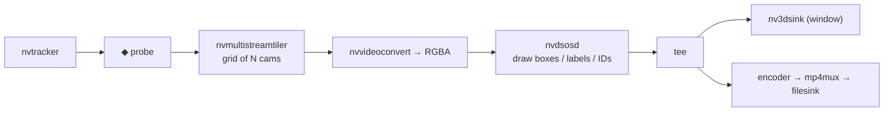
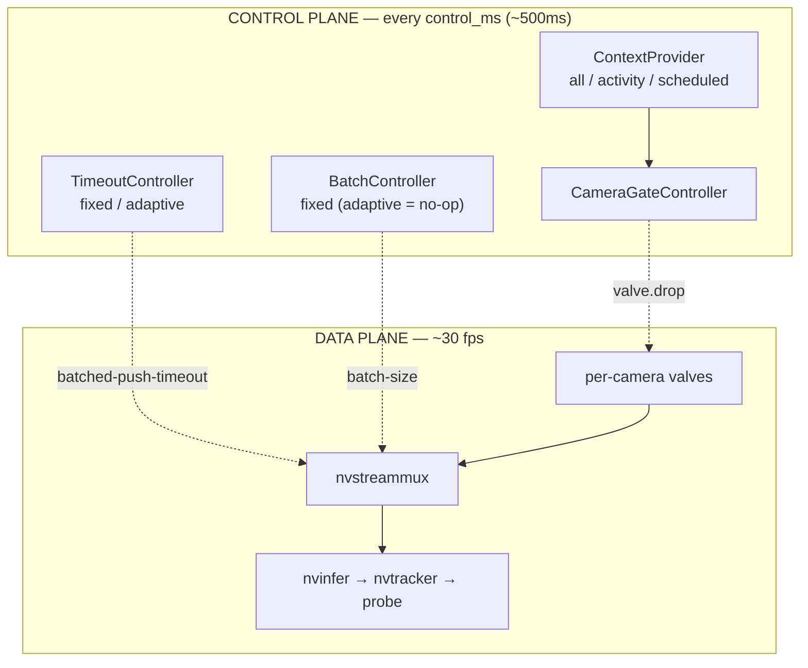
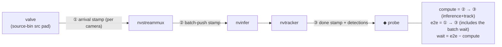

# Pipeline structure under different conditions — Python / legacy-mux app

> **Scope:** this doc describes the **Python app on the legacy `nvstreammux`**.
> The C++ port on the **new** nvstreammux (28 ms p50 e2e baseline) lives in
> [`cpp/`](cpp/README.md).
>
> The diagrams are **Mermaid** — they render as real graphs on GitHub, VS Code
> (Markdown preview), Obsidian, and most web viewers. Reading the raw file in a
> terminal? The **ASCII diagram in §1** and the element table below still read fine.

The pipeline has **two planes**:

- **Data plane** — camera frames flowing through GStreamer elements (~30 fps).
- **Control plane** — controllers that *reshape* the data plane every `control_ms`
  (default 500 ms): which cameras are active, the batch timeout, the batch size.

This doc draws the **data plane** under each operating condition, then the
**control plane** and the **measurement probes**. Everything matches
`pipeline_builder.py`.

## Elements at a glance

| element | role |
|---|---|
| `v4l2src` / `filesrc` | capture a live camera / replay a recorded clip |
| `jpegparse` → `nvjpegdec` | parse + HW-decode MJPEG (live C920) |
| `qtdemux` → `h264parse` → `nvv4l2decoder` | demux + HW-decode H.264 (file replay) |
| `nvvideoconvert` (+ NVMM caps) | move the frame into GPU memory (NVMM NV12) |
| `valve` | **the camera-skip gate** — `drop=True` stops this camera feeding the mux |
| `nvstreammux` | batch N cameras into one buffer (`batch-size`, `batched-push-timeout`, `sync-inputs`) |
| `nvinfer` (PGIE) | run the detection engine on the batch (dynamic, 1–4) |
| `nvtracker` | assign persistent track IDs |
| detection **probe** | read metadata (detections + latency) — where metrics & app logic tap in |
| `fakesink` *or* `nvmultistreamtiler`+`nvdsosd`+`nv3dsink` | discard (headless) *or* tile + draw + show (debug) |

---

## 1. Baseline — all cameras active, sync off, headless (the default)



ASCII fallback:

```
cam0: v4l2src → jpegparse → nvjpegdec → nvvideoconvert → valve(open) ┐
cam1: …front…                                          → valve(open) ┤   batch of 4
cam2: …front…                                          → valve(open) ┼→ nvstreammux ─→ nvinfer ─→ nvtracker ─◆probe─→ nvvideoconvert → fakesink
cam3: …front…                                          → valve(open) ┘  (33ms, sync off)  (dynamic 1-4)
```

**How it works:** each camera decodes into GPU memory; all four valves are open, so
the mux collects one frame per camera and pushes a **batch of 4** every ~33 ms (or
sooner if all four arrive early). `nvinfer` runs **one** inference pass over the 4,
the tracker adds IDs, and the probe hands detections to the app.
**Measured:** ~120 fps (4×30), every camera covered — the recommended operating
point for independent per-camera detection.

---

## 2. Camera skipping — context-aware (`activity` / `scheduled`)



**How it works:** the control plane closes cam2/cam3's valves (`drop=True`). Those
cameras stop feeding the mux, so the batch shrinks to **2 real frames**, and the
**dynamic engine runs batch-2 → about half the compute.**
**Measured:** compute −59 to −66%, but throughput −50% (you cover 2 cameras, not 4).
⚠️ The legacy mux pads the skipped slots with a **repeated stale frame** so
`num_frames_in_batch` still reads 4 — a *phantom* that produces no detections. That's
why real throughput is counted with **`n_active`**, not the mux's number.

---

## 3. Sync-on — time-align inputs (`sync-inputs=1`)



**How it works:** the mux holds each frame to its **PTS-time** and **drops any that
can't align within `max-latency`**. Free-running cameras are never perfectly in
phase, so it usually lands **1–2 frames per batch** (the rest dropped).
**Measured:** e2e 30→96 ms, throughput 120→30–60 fps. Since you don't fuse cameras,
this is pure cost → **keep sync off.**
Note: `batched-push-timeout` is *required* here, not redundant — it's the thing that
pushes the perpetually-incomplete batch. Set it to 0 and the pipeline **hangs**
(it waits forever for a complete batch that sync guarantees never forms).

> **(errata 2026-07-07: root cause found — it is not camera phase.)** The sync
> starvation is caused by **`jpegparse` re-stamping live PTS** (GstBaseParse,
> GStreamer 1.20): each camera's frames land on a synthetic per-camera 33.33 ms
> grid anchored at that camera's *own first frame*, so the four grids sit
> **1.05–1.5 s apart** (USB startup stagger) and the mux is aligning synthetic
> timelines that never coincide. Evidence + fix:
> [`cpp/experiments/frame_timing/`](cpp/experiments/frame_timing/); a PTS-restore
> fix now exists in `cpp/src/pipeline_builder.cpp` (probes on jpegparse's pads
> restore the true kernel capture stamps; ON by default in `cpp/multicam_rt`,
> `--no-pts-fix` to disable). The numbers above are **pre-fix, legacy-Python-mux**
> measurements. Pre-fix, the only viable sync-on configuration was the C++
> new-mux `--sync --max-latency-ms 2000 --timeout-us 33333` (a window wide enough
> to bridge the grid offsets); the legacy Python app **freezes** at
> `max-latency ≥ 500 ms`.

---

## 4. Source front — live capture vs file replay



**How it works:** everything from `nvvideoconvert` onward is **identical**; only the
**front** and one mux property differ. File replay exists for **reproducible
benchmarks** — replaying the same clips makes A/B runs comparable. It sets
`live-source=0` and `fakesink sync=1` so playback is paced to real time.
**Caveat:** 4× H.264 decode inflates compute ~3× vs live, so treat replay latencies
as *relative*, not absolute.

---

## 5. Debug / display tail (`--display` / `--record`)



**How it works:** same trunk, but instead of `fakesink` the tail **tiles** all
cameras onto one canvas, **draws** boxes/labels/track-IDs with `nvdsosd`, and shows
it (`nv3dsink`) and/or records it (`tee → encoder → mp4`). The detection probe still
runs — the tail only changes what a human sees, not what the pipeline computes.

---

## Techniques — how each is *defined* and what it does to the pipeline

The conditions above show the *structure*. These are the **techniques** that produce
them — each one's precise definition, how the pipeline then runs, and the measured
verdict.

| technique | one-line definition | knob | verdict |
|---|---|---|---|
| Dynamic-batch engine | one engine that runs any batch 1–N | TensorRT `min=1/opt=4/max=4` | **essential** (enables skipping's savings) |
| Camera skipping | gate cameras in/out by context | per-camera `valve.drop` | **the real win** (compute↓, coverage↓) |
| Dynamic (adaptive) timeout | shrink the mux wait when fewer cams are active | `batched-push-timeout` | cuts *wait*, but net Pareto-dominated |
| Batch-size adaptation | shrink `batch-size` to the active count | `nvstreammux batch-size` | **no-op** on legacy mux |
| Input synchronization | time-align frames by PTS | `sync-inputs` + `max-latency` | fusion-only; **harmful here** |
| Batched-push-timeout | deadline to push an incomplete batch | `batched-push-timeout` | required base mechanism |

### T1 · Dynamic-batch engine
**Definition:** a TensorRT engine built with **dynamic shapes** — batch dimension
`min=1, opt=4, max=4` (`models/model_b4_gpu0_fp16.engine`). It accepts *any* batch
from 1 to 4 at runtime; `batch-size` reserves the max, the engine runs whatever
actually arrives.
**In the pipeline:** `nvinfer` reads `num_frames_in_batch` and runs the engine at
exactly that size — 4 cameras → batch-4 pass; 2 cameras (skipping) → batch-2 pass.
**Verdict (measured):** compute **scales with the actual count** (100 ms @4 → 51 ms
@2). This is what makes skipping *actually* save compute — a truly fixed-batch engine
would pad partial batches back to 4 and save nothing. Required, not optional.

### T2 · Context-aware camera skipping
**Definition:** a **ContextProvider** decides the *active set*, and
**CameraGateController** opens/closes each camera's `valve` to match. Three providers:
- `all` — never skip (baseline).
- `scheduled` — drop a fixed set at fixed times (reproducible experiments).
- `activity` — drop a camera after `idle_secs` (3 s) with no detections; re-check it
  every `reprobe_secs` (2 s).
**In the pipeline:** a skipped camera's `valve.drop=True` → it stops feeding the mux →
the batch shrinks → the dynamic engine does less work. (See condition §2.)
**Verdict (measured):** the **only real win** — compute −59…−66% (power/thermal). Cost:
throughput −50% (fewer cameras covered). `activity` self-tunes to the scene (kept the
one busy camera at 100%, skipped the empty ones with 2 s reprobes) but has a **worse
p99 tail** from the reprobe blips.

### T3 · Dynamic (adaptive) batching timeout
**Definition:** the mux wait shrinks in proportion to how many cameras are active:
```
batched-push-timeout = clamp( base_us × (n_active / num_cams),  min_us, max_us )
```
(`TimeoutController`, policy `adaptive`; `fixed` just holds `base_us`.)
**In the pipeline:** when skipping to 2 of 4, the timeout halves (33→16 ms), so the mux
gives up waiting sooner and pushes the small batch faster.
**Verdict (measured):** it *does* cut the **wait** (30→15 ms) — but in the campaign it
**raised compute** and the net e2e was **Pareto-dominated by a fixed timeout**. Inert
when all cameras are active (fraction = 1). Real effect, but not a net win here.

### T4 · Batch-size adaptation
**Definition:** `BatchController` sets `nvstreammux batch-size` = active-camera count
each control tick, hoping a "full" small batch pushes immediately.
**In the pipeline:** it changes the property… and nothing else happens.
**Verdict (measured): negative result.** The legacy mux pushes on *"all connected pads
delivered OR timeout"*, **not** on batch-size — so a smaller `batch-size` never triggers
an early push (isolated test: wait ~54 ms @bs4 vs ~90 ms @bs2, i.e. worse). Default
`fixed`. A genuine early-push would need the **new** nvstreammux — *(update
2026-07-07: now implemented — the C++ port in [`cpp/`](cpp/README.md) runs the new
mux; measured 28 ms p50 e2e baseline.)*

### T5 · Input synchronization
**Definition:** `sync-inputs=1` makes the mux **time-align** frames by PTS, holding each
to its clock-time and **dropping** any that can't align within `max-latency` (~33 ms).
**In the pipeline:** with free-running cameras it drops most frames → batches of 1–2
instead of 4 (condition §3), and holds the on-time frames (adds latency).
**Verdict (measured):** built for **sensor fusion** (a coherent all-camera snapshot).
Your pipeline detects each camera independently, so it's pure cost — e2e 30→96 ms,
throughput 120→30–60 fps. **Off by default.**
*(errata 2026-07-07: the 1–2-frame batches come from `jpegparse` PTS re-stamping
onto offset per-camera grids, not from camera phase — see the dated note in
condition §3 and [`cpp/experiments/frame_timing/`](cpp/experiments/frame_timing/);
the numbers here are pre-fix, legacy-Python-mux measurements.)*

### T6 · Batched-push-timeout (the base batching mechanism)
**Definition:** microseconds to wait *after the first frame of a batch arrives* before
pushing an **incomplete** batch. The timer **starts on the first frame of each new
batch**; the mux pushes when **all pads delivered OR the timeout fires**. Default
33333 µs ≈ one 30 fps frame interval.
**In the pipeline:** it's the "don't wait forever" deadline that guarantees a batch
gets pushed. Under sync (where batches never complete) it's the thing doing every push
— set it to 0 and the pipeline **hangs**.
**Verdict (measured):** a **latency ↔ batch-fullness tradeoff**. Smaller = lower latency
but more fragmented batches; under sync the benefit floors around **2–3 ms** (below that
is measurement noise). 33 ms is well-matched to 4 free-running 30 fps cameras.

---

## The two planes — data vs control



**How it works:** every `control_ms`, one tick runs three controllers:
- **CameraGateController** ← a **ContextProvider** (`all` / `activity` / `scheduled`)
  → sets each `valve.drop` (which cameras are active).
- **TimeoutController** → sets `batched-push-timeout` (fixed, or adaptive =
  base × active/total).
- **BatchController** → sets `batch-size` (fixed by default; adaptive is a proven
  no-op on the legacy mux).

The data plane runs at frame rate (~30 fps); the control plane re-tunes it at tick
rate (~2 Hz). They're decoupled — that's why skipping/timeout changes take effect
"between" frames.

---

## Where latency is measured (the 3 probes)



**How it works:** `metrics.py` stamps each frame **by PTS** at three points — after
the valve (arrival), at the mux src (batch pushed = compute starts), and at the
tracker src (inference+track done). From these it derives **compute** (mux→tracker),
**e2e** (source→tracker, which *includes* the batch wait because the mux
re-timestamps the batch), and **wait** (e2e − compute). Keying by PTS rather than
FIFO order means a dropped frame can't permanently desync the pairing.
*(errata 2026-07-07: which timeline that PTS lives on matters — on pre-fix runs it
is the **synthetic** post-`jpegparse` per-camera 33.33 ms grid, not capture time;
with the 2026-07-07 C++ PTS-restore fix it is the **true kernel capture stamp** —
see [`cpp/experiments/frame_timing/`](cpp/experiments/frame_timing/).)*
