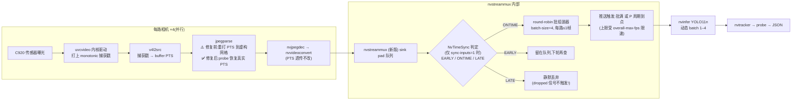

# sync-inputs 端到端工作机制详解(PTS 修复前 vs 修复后)

*2026-07-08。基于:新 nvstreammux 源码(设备上
`/opt/nvidia/deepstream/deepstream-7.1/sources/`,已逐行核对)、
`campaign_2026-07-07_ptsfix` 实测数据、`cpp/experiments/frame_timing` 实验、
以及 `experiments/results/timeout_sweep_cpp_dynamic*` 的 live A/B。*

---

## 0. 一句话结论

**sync-on 不是"把四路帧按时间戳对齐"那么简单:它是一个以推送周期 P 为锚点、
以 max-latency L 为宽度的滑动"帧龄准入窗口"。** 修复前,jpegparse 把每路相机的
PTS 重打到各自的虚构网格上(相互恒差 1.05–1.47 s),窗口对齐的是虚构时间 →
大量丢帧;修复后窗口对齐真实内核捕获时间,丢帧率降到 ~1%,但 sync-on 仍要
付出一个推送周期(+31 ms)的**结构性延迟下限** —— 这是准入规则本身决定的,
调任何参数都消不掉。

---

## 1. 管线全景与时间戳的一生



时间戳在各阶段的遭遇:

| 阶段 | 元件 | 时间戳发生了什么 |
|---|---|---|
| 0 | 传感器 + `uvcvideo` | 内核在 URB 完成时打 **monotonic 捕获戳** —— 全程唯一的"真话" |
| 1 | `v4l2src` | 把内核捕获戳换算成 buffer 的 PTS(running time 域) |
| 2 | `jpegparse` | **问题源头**:见 §3。修复前在此被替换成虚构网格;修复后由两个 probe 原样恢复 |
| 3 | `nvjpegdec` / `nvvideoconvert` | 透传,不改 PTS |
| 4 | mux sink pad | 入队等待判定;`sync-inputs=1` 时进入 §2 的准入窗口逻辑 |

---

## 2. mux 内部:sync 的精确规则(源码级)

### 2.1 三个参数共同定义 sync,不止 max-latency 一个

| 参数 | 记号 | 作用 | 设置途径 |
|---|---|---|---|
| `sync-inputs=1` | — | 安装 `NvTimeSync` 判定器;不开则完全不查时间戳 | 属性(`--sync`) |
| `max-latency` | **L** | 准入窗口的**宽度** | 属性(`--max-latency-ms`) |
| `overall-min-fps` ≡ `batched-push-timeout` | **P** | 推送周期,**同时是窗口的锚点** | INI 或属性——**同一个内部字段**,后写者赢(`nvstreammux_batch.cpp:329`:`set_batch_push_timeout()` 直接写 `overall_min_fps_n = 1000000/timeout`;2026-07-07 起本 app 先载 INI,故 CLI `--timeout-us` 生效) |

辅助参数:`overall-max-fps`(推送上限/早闸)、`max-same-source-frames=1`
(每批每路最多 1 帧)、`algorithm-type=1`(round-robin)、adaptive-batching
(批大小 = 活跃源数)。

### 2.2 准入窗口公式(`gstnvtimesynch.cpp:119`,`NvTimeSync::get_synch_info`)

设帧的 running time 为 **B**,当前流水线时钟 running time 为 **now**:

```
EARLY   若  B > now − P                      (太年轻,还不许进批)
ONTIME  若  now − P − L  ≤  B  ≤  now − P    (准入)
LATE    若  B + L < now − P                  (过期 → 丢弃)
```

```
                    ←———— L ————→
 ──────────────────┼─────────────┼──────────────┼────────→ 时间
                now−P−L        now−P           now
      LATE(丢弃) │   ONTIME    │    EARLY(等待)│
```

**关键推论:一帧必须"老到"至少 P 才有资格进批,老过 P+L 即被丢弃。**
窗口锚在"一个推送周期之前",宽度是 L。

### 2.2.1 数值例子

取本 app 的默认配置:**P = 33.3 ms**(`--timeout-us 33333`),**L = 33 ms**
(`--max-latency-ms 33`),设当前时钟 **now = 10 000.0 ms**。则准入窗口为:

```
[now − P − L, now − P] = [10000 − 33.3 − 33, 10000 − 33.3] = [9933.7, 9966.7] ms
```

**例 1 —— 三种判定结果**(帧龄 = now − B):

| 帧 | 捕获时刻 B | 帧龄 | 判定 | 后续 |
|---|---|---|---|---|
| A(cam0) | 9980.0 | 20 ms | B > 9966.7 → **EARLY** | 留队;等到 now = 10013.3(帧龄满 P=33.3)才准入,直到 now = 10046.3(帧龄超 P+L=66.3)前一直有效 |
| B(cam1) | 9950.0 | 50 ms | 落在 [9933.7, 9966.7] → **ONTIME** | 进入本轮组批 |
| C(cam2) | 9920.0 | 80 ms | B + L = 9953 < 9966.7 → **LATE** | 静默删除。80 ms 帧龄说明上游(USB/解码/排队)多耗了约两个帧周期 —— 回放中 L=2 ms 时 19% 的丢弃正是这类抖动 |

**例 2 —— L 只改丢弃率,不改延迟:** 同一个帧 C(帧龄 80 ms),若把 L 调到
66.7 ms,则 P + L = 100 ms > 80 ms → **ONTIME**,不再被丢。这就是 live 实测中
coverage 随 L 从 98.9%(ml16)升到 99.7%(ml133)、而 e2e 延迟纹丝不动
(98.8 → 101.5 ms)的微观原因。

**例 3 —— 延迟下限 +P 是怎么来的:** 某帧在 t = 5000.0 ms 捕获。无论 L 取
16 还是 133,它在 now < 5033.3 之前都是 EARLY —— **每一帧都必须先在 mux 里
"陈化"满一个 P 才有资格进批**。这就是 live 实测 sync-on 比 sync-off 平均慢
+31 ms(69.3 → 100.3 ms,≈ P = 33.3 ms)的全部来源。sync-off 时同一帧到达
即刻可进批,没有陈化要求。

**例 4 —— 为什么 sync-on 时不能调大 `--timeout-us`:** 若把 P 提到 100 ms
(L 仍 33),窗口变成 [now − 133, now − 100]:每帧必须先陈化 100 ms,而
133 ms 就过期 —— 窗口宽度没变,却整体后移,延迟起步 +100 ms,且抖动稍大
就 LATE。

**例 5 —— 修复前的世界代入同一公式:** 四路同一瞬间捕获的帧,经 jpegparse
重打后名义 PTS 相差 0 / 1134.8 / 1702.1 / 567.2 ms。设 cam0 的帧此刻恰好
ONTIME(B = 9950),则 cam2 同瞬帧的名义 B = 9950 − 1702.1 = 8247.9,
B + L = 8280.9 ≪ 9966.7 → **一到即 LATE,直接删除**。任何毫秒级窗口都不可能
同时罩住相差 >0.5 s 的四张网格 —— 所以修复前唯一"能用"的配置是
ml ≈ 2000 ms(窗口宽过最大网格偏移 1.7 s),而这对齐的仍是虚构时间。

### 2.3 批组装器如何执行判定(`nvstreammux_batch.cpp:540–585`)

每轮组批时逐路扫描队列:

- **EARLY** → 立即停止扫描该路(后面的帧只会更年轻),帧**留在队列**等下轮;
- **LATE** → 从队列**静默删除**。`removing_old_buffer()` 只是一行 debug log ——
  **这就是 `dropped` 信号从不触发的原因**(实测确认过,插件级信号根本没发);
- **ONTIME** → 计入可用帧,round-robin 组装,批满(4 路各 1 帧)即推,
  否则 P 到点推残批;推送节奏上限受 `overall-max-fps` 限制。

---

## 3. 修复前的世界:对"虚构时间"做对齐

### 3.1 jpegparse 干了什么

jpegparse 会**丢掉上游 PTS,把每路相机的帧重打到各自的理想 33.33 ms 网格上,
网格零点 = 该相机第一帧的时刻**。四路相机经 USB 枚举依次启动,起点相差
0.6–1.7 s,于是四张网格之间存在**恒定 1.05–1.47 s 的相对偏移**:

```
真实捕获(内核戳):四路其实交错得很好,p50 仅 8.9 ms
 cam0  ●     ●     ●     ●     ●          ← 真实时刻近乎交错重合
 cam1   ●     ●     ●     ●     ●
 cam2  ●     ●     ●     ●     ●
 cam3   ●     ●     ●     ●     ●

jpegparse 重打后(mux 看到的 PTS):同一瞬间捕获的四帧,被标成相差 >1 秒
 cam0  |––––网格0(锚=cam0启动)  ●  ●  ●  ●
 cam1        |←— +1.13 s —→|––––网格1        ●  ●  ●  ●
 cam2              |←—— +1.70 s ——→|––––网格2       ●  ●  ●  ●
 cam3     |← +0.57 s →|––––网格3     ●  ●  ●  ●
```

### 3.2 后果(实测)

mux 的准入窗口是同一个 `[now−P−L, now−P]`,但它比较的是**虚构 PTS**:
同一瞬间到达的四帧,"名义帧龄"相差 1 秒以上,永远不可能同时落进一个
几十毫秒宽的窗口。

| 现象 | 数字 |
|---|---|
| Python 战役:`sync-inputs=1` 静默丢弃 | **93.6% 的全部帧** |
| 批大小被卡死 | 4 路只有 **2 路**能同批(窗口只罩得住相邻的两张网格) |
| 回放复现(broken 世界,ml 2→133 ms) | fill 卡在 3.7–3.85,丢弃 **33–47.5%**,与窗口宽度几乎无关 |
| 唯一"能用"的配置 | `ml=2000 ms`(窗口宽过网格最大偏移)—— 100% full,但纯属把窗口撑到能吞下虚构偏移 |
| 讽刺之处 | 真实捕获交错 p50 8.9 ms,**比硬件同步的 nuScenes(39–46 ms)还紧** —— 物理上根本不需要对齐,是时间戳在说谎 |

---

## 4. 修复后的世界:对真实捕获时间做对齐

### 4.1 修复怎么做的(`cpp/src/pipeline_builder.cpp:59–139`,默认开启,`--no-pts-fix` 关闭)

在**每个 jpegparse 前后各挂一个 pad probe**:

- sink 侧 probe:把进入 jpegparse 的**真实内核捕获 PTS** 压入一个深度 ≤4 的
  小 FIFO(超过 4 帧积压会告警"restored PTS may be off by one period");
- src 侧 probe:对每个输出 buffer 弹出对应的真实 PTS **原样回写**,覆盖掉
  jpegparse 刚打上的网格值。

下游(解码、mux)从此看到的就是内核捕获时间。

### 4.2 后果(实测)

| 现象 | 数字 |
|---|---|
| 时间戳正确率 | 100% 真实捕获戳(战役验证) |
| 回放(fixed 世界):保留率 | **99.9%**,fill 4.00,~100% full |
| 批内对齐质量 | **2.1 ms**(比 ml=2000 硬撑的虚构对齐真实得多) |
| 丢弃率 vs 窗口宽度(回放,push 33.3 ms) | 19.1% @ L=2 ms → 4.5% @ 33.3 → 1.0% @ 66.7 → **0.1% @ 133** |
| live 全 app(push 33.3 ms,sync-on) | fill 3.84–3.86,coverage 98.9%(ml16)→ 99.7%(ml133) |

### 4.3 但 sync-on 仍有结构性代价(这是新发现,源码+实测互证)

live A/B(push 33.3 ms,四路 C920,YOLO11n):

| 配置 | e2e 均值 | e2e p99 | fill | coverage |
|---|---|---|---|---|
| **sync-off** | **69.3 ms** | 149.3 ms | 3.85 | **100.0%** |
| sync-on, ml=16 | 98.8 ms | 142.0 ms | 3.84 | 98.9% |
| sync-on, ml=66.7 | 100.3 ms | 144.7 ms | 3.86 | 99.6% |
| sync-on, ml=133 | 101.5 ms | 148.4 ms | 3.86 | 99.7% |

两个由准入公式直接解释的现象:

1. **e2e 对 L 完全不敏感**(98.8 / 100.3 / 101.5 ms):延迟由锚点 **P** 决定
   (帧必须先老到 P 才准入),L 只决定窗口宽度即**丢弃率**(coverage
   98.9→99.7%),不决定延迟。
2. **+31 ms ≈ P = 33.3 ms**:sync-off 的帧到了就能进批,sync-on 的帧必须
   先等满一个推送周期。**在同等推送节奏下,sync-on 永远不可能追平
   sync-off 的延迟 —— 下限写死在准入规则里。**

由此还有一个操作性推论:sync-on 时**不要调大 `--timeout-us`** —— 它同时把
窗口锚点推得更远,帧要等更久、也更容易过期(P+L)被丢。

---

## 5. 修复前 vs 修复后:一张对照表

| | 修复前(网格 PTS) | 修复后(真实 PTS) |
|---|---|---|
| mux 对齐的对象 | 每路各自的虚构 33.33 ms 网格(互差 1.05–1.47 s) | 内核捕获时刻(真实交错 p50 8.9 ms) |
| sync-on 丢帧 | 93.6%(live)/ 33–47%(回放),且与窗口宽度几乎无关 | ~1% @ L=66.7 ms;0.1% @ 133 ms |
| 批大小 | 卡死在 2/4 | 3.84–4.00 |
| 可用的窗口 | 只有 ml≈2000 ms(硬吞虚构偏移) | 16–133 ms 皆可用,推荐 66.7 |
| 批内真实对齐 | 无意义(对齐的是虚构时间) | 2.1 ms |
| sync-on 延迟代价 | 被丢帧灾难掩盖,无从谈起 | 清晰可测:+P(≈31 ms)结构性下限 |
| 丢弃可观测性 | 静默(`dropped` 信号不触发) | 仍然静默(该行为与修复无关,是 mux 源码如此) |
| 论文口径 | "同步不可用/有害" | "同步可用但**不必要且不划算**:物理交错已够紧,而正确对齐仍要付 +P 延迟和 ~1% 丢帧" |

---

## 6. 数据与源码出处

- 准入规则:`/opt/nvidia/deepstream/deepstream-7.1/sources/gst-plugins/gst-nvmultistream2/gstnvtimesynch.cpp:119`
- EARLY/LATE 处理与静默丢弃:`.../sources/libs/nvstreammux/nvstreammux_batch.cpp:540–585`
- P 与 INI 同字段:`.../nvstreammux_batch.cpp:329`(`set_batch_push_timeout`)
- PTS 修复实现:`cpp/src/pipeline_builder.cpp:59–139`(`attach_pts_fix` 及两个 probe)
- 回放窗口扫描:`cpp/experiments/frame_timing/results/sync_replay_sweep/summary.md`
- live A/B:`experiments/results/timeout_sweep_cpp_dynamic{,_sync,_sync_ml16,_sync_ml66.7,_sync_ml133}/summary.csv`
- 修复战役总报告:`experiments/results/campaign_2026-07-07_ptsfix/REPORT.md`
- 修复前历史(93.6%、2/4 卡批、ml-2000):`cpp/experiments/frame_timing/README.md` §5.4–5.5 及 Python 战役报告

> 注:`cpp/TUTORIAL.md` Step 4 中"62% 丢帧"的小表在报告核验中被标记为
> 不可复现(errata 2026-07-07),本文档不引用该数字;其"mux 把每帧持有到
> 其时间戳"的表述也不精确 —— 准确说法是**持有到帧龄满一个推送周期 P**。
