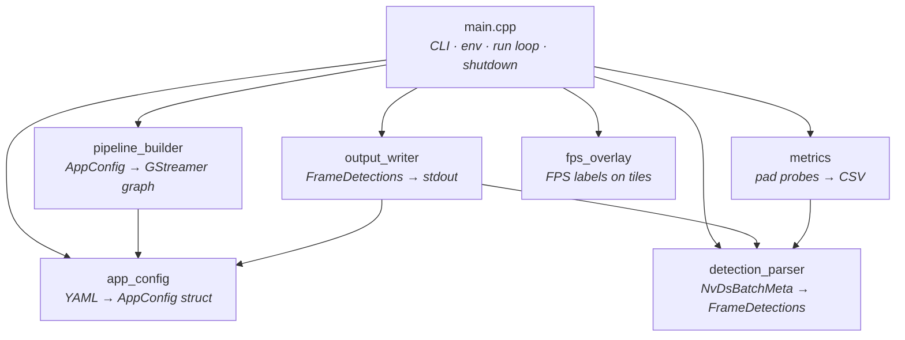
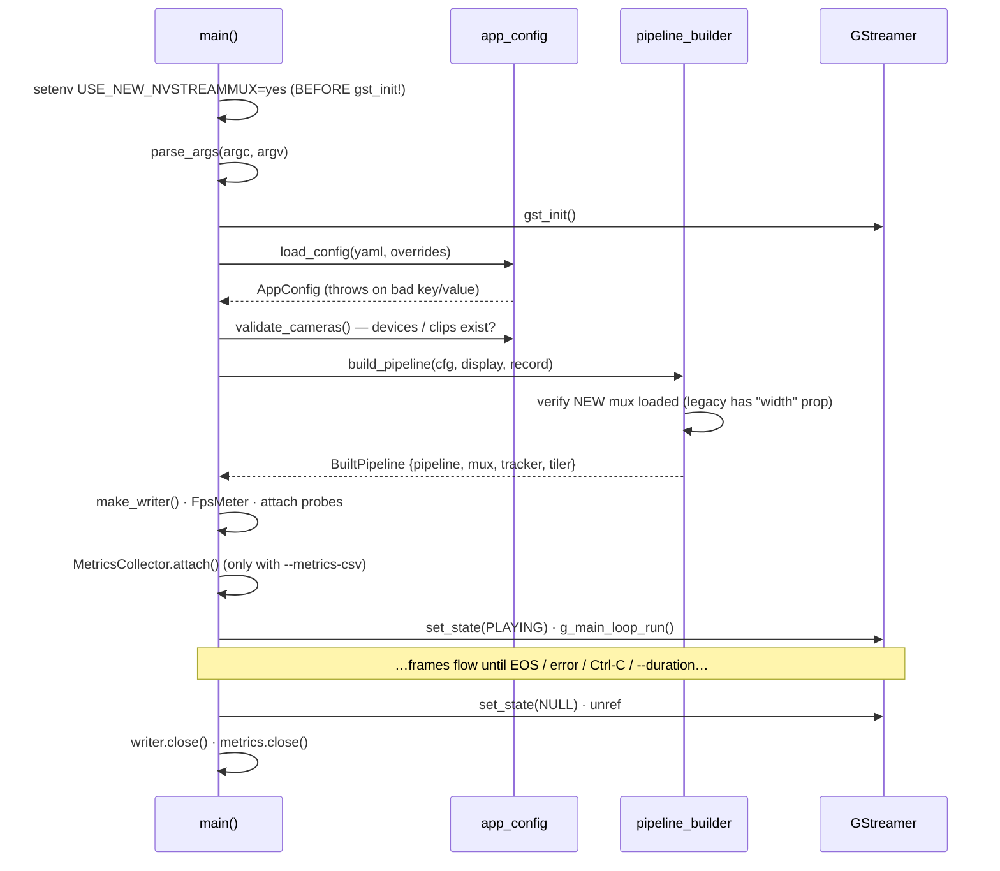
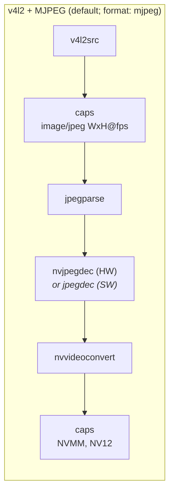
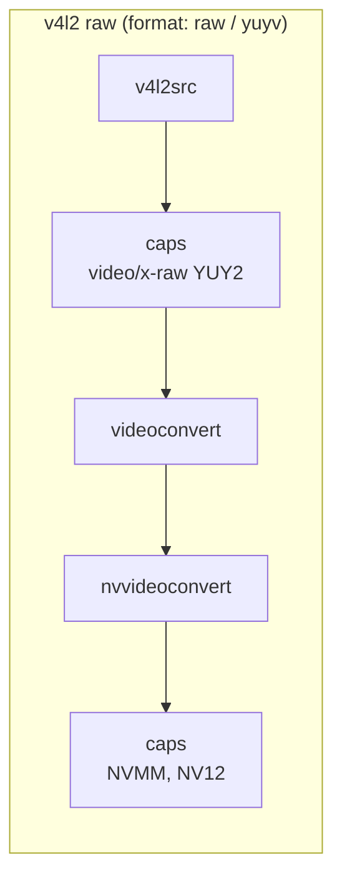
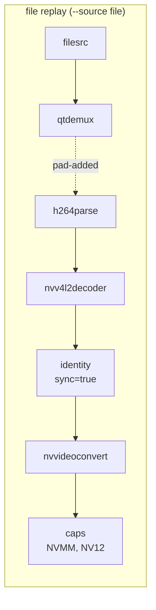
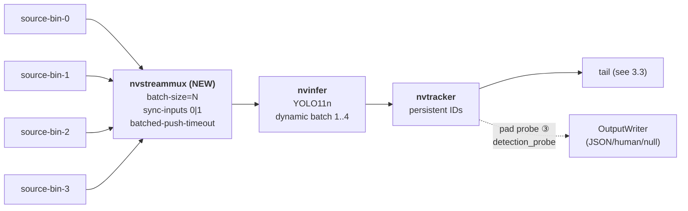
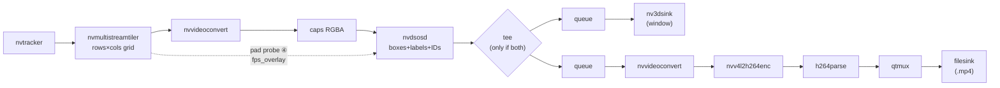

# Architecture — how the C++ app fits together

Companion to [`TUTORIAL.md`](TUTORIAL.md) (which covers *running* the app).
This document covers the *code*: what each file does, how the modules relate,
what GStreamer pipeline gets built in each mode, and where to plug in changes.

---

## 1. The modules and how they relate

Six modules, one job each:

| file | job | knows about |
|---|---|---|
| `main.cpp` | CLI parsing, env setup, wiring everything together, GLib main loop, clean shutdown | *all other modules* |
| `app_config.[ch]pp` | load + validate `config/camera_params.yaml` into plain structs (`AppConfig`) | yaml-cpp only — **no GStreamer** |
| `pipeline_builder.[ch]pp` | turn an `AppConfig` into a linked GStreamer pipeline (`BuiltPipeline`) | GStreamer + `AppConfig` |
| `detection_parser.[ch]pp` | walk DeepStream's `NvDsBatchMeta` into plain `FrameDetections` structs | DeepStream meta only — **no GStreamer elements** |
| `output_writer.[ch]pp` | the single exit point for detections: JSON / human / null sinks | `FrameDetections` + `OutputCfg` |
| `metrics.[ch]pp` | latency/throughput CSV via its own pad probes (self-contained, optional) | GStreamer + `detection_parser` |
| `fps_overlay.[ch]pp` | per-tile FPS labels in the display/record view (optional) | GStreamer + DeepStream display meta |

### Include / dependency graph

Arrows mean "includes / uses". Note the deliberate shape: `main.cpp` is the
only file that knows about everything; the leaf modules don't know about each
other except through the two shared *data* types (`AppConfig`,
`FrameDetections`).

```
                        ┌─────────────┐
                        │  main.cpp   │  (owns the run loop; wires all below)
                        └──────┬──────┘
      ┌───────────┬────────────┼─────────────┬──────────────┐
      ▼           ▼            ▼             ▼              ▼
┌───────────┐ ┌──────────┐ ┌─────────┐ ┌────────────┐ ┌───────────┐
│app_config │ │ pipeline │ │ metrics │ │  output_   │ │   fps_    │
│  (YAML →  │ │ _builder │ │ (probes │ │  writer    │ │  overlay  │
│  structs) │ │ (structs │ │  → CSV) │ │ (frames →  │ │ (FPS text │
│           │ │  → gst)  │ │         │ │  stdout)   │ │  on tiles)│
└───────────┘ └────┬─────┘ └────┬────┘ └─────┬──────┘ └───────────┘
      ▲            │            │            │
      └────────────┘            ▼            ▼
                          ┌──────────────────────┐
                          │  detection_parser    │  (NvDsBatchMeta →
                          │  (shared data types) │   FrameDetections)
                          └──────────────────────┘
```

The same graph in Mermaid (renders on GitHub):



### Why this shape

- **`app_config` has no GStreamer** — config problems fail in milliseconds
  with a clear message, before any camera is opened or engine loaded.
- **`detection_parser` is pure data** — everything downstream of the probe
  (writers, metrics, future ROS/socket sinks) works on plain C++ structs and
  never touches DeepStream types again.
- **`output_writer` is the single exit point** — the pad probe calls
  `write_batch()` and nothing else, so redirecting output (socket, queue,
  DB…) touches exactly one file.
- **`metrics` and `fps_overlay` are optional bolt-ons** — each attaches its
  own probes and can be deleted from the build without touching the trunk.

---

## 2. Startup sequence (what `main()` actually does)



Two ordering rules are load-bearing:

1. **`USE_NEW_NVSTREAMMUX=yes` must be set before `gst_init()`** — the plugin
   decides which mux implementation to register at load time.
   `build_streammux()` double-checks (the legacy mux exposes a `width`
   property; the new one doesn't) and throws rather than silently running a
   different pipeline.
2. **Shutdown sends EOS first, quits later.** First Ctrl-C (or `--duration`
   expiry) *injects EOS* into the pipeline; the MP4 muxer and metrics then
   finalize, the EOS reaches the bus, and only that quits the loop. A second
   Ctrl-C force-quits.

---

## 3. The GStreamer pipeline that gets built

### 3.1 Per-camera source bin (one per `cameras:` entry)

Each camera becomes a self-contained `GstBin` (`source-bin-<i>`) with a single
ghost `src` pad that always emits `video/x-raw(memory:NVMM),format=NV12` —
exactly what an nvstreammux sink pad wants. Three front variants:







Notes:
- **`identity sync=true`** is the replay-realism trick: it paces each stream
  against the pipeline clock *right after the decoder*, so frames arrive at
  the mux with live timing. (The new mux has no `live-source` property, and
  pacing at the sink can't restore per-source arrival phase — which is what
  `--sync` experiments depend on.)
- **`qtdemux`'s pads are dynamic** — the `pad-added` signal links its video
  pad to `h264parse` at runtime (`on_demux_pad_added`).
- **MJPEG decode is `jpegparse ! nvjpegdec`, never `nvv4l2decoder mjpeg=1`** —
  the C920 emits 4:2:2 JPEG; nvv4l2decoder only handles 4:2:0.

### 3.2 The shared trunk (both variants, all modes)



- Each `source-bin-<i>` ghost pad links to mux request pad `sink_<i>` — this
  index **is** the `camera_id` (`source_id`) in every downstream record.
- `--sync` flips `sync-inputs=1` + `max-latency` on the mux; nothing else in
  the graph changes between the two variants.
- The **detection probe** on nvtracker's src pad is where pixels turn into
  data: `parse_batch_meta()` → `FrameDetections` → `writer->write_batch()`.
  It sits on the *tracker* (not PGIE) because `object_id` is only populated
  after nvtracker.

### 3.3 The tail — decided by `--display` / `--record`

| mode | tail |
|---|---|
| headless (default) | `tracker → nvvideoconvert → fakesink sync=false` |
| `--display` | `tracker → tiler → conv → caps(RGBA) → nvdsosd → queue → nv3dsink` |
| `--record P` | `… nvdsosd → queue → conv → caps(NV12) → nvv4l2h264enc → h264parse → qtmux → filesink` |
| both | `… nvdsosd → tee →` both branches above |



- Frames are *discarded* in headless mode — detections leave via the probe,
  so the fakesink tail costs nothing.
- All sinks run `sync=false`: live sources are already real-time, and file
  replay is already paced upstream by `identity sync=true`, so the sink must
  never add a second wait on the clock.
- `nvdsosd` needs RGBA in, hence the convert+caps before it; the encoder
  needs NV12, hence the convert back on the record branch.

---

## 4. Data flow: the two parallel paths

Buffers (video) and the things we *extract* from them travel differently:

```
  VIDEO BUFFERS (NVMM, on-GPU)              EXTRACTED DATA (plain C++)
  ─────────────────────────────             ──────────────────────────
  source bins ─► mux ─► pgie ─► tracker ─► tail(sink)
       │          │              │
       │ ①        │ ②            │ ③  detection_probe (main.cpp)
       │          │              │      └─ parse_batch_meta() ─► FrameDetections
       │          │              │           ├─► OutputWriter (stdout JSON/human)
       │          │              │           └─► FpsMeter.tick()   (display/record only)
       │          │              │
       └──────────┴──────────────┴──── MetricsCollector (--metrics-csv only)
          arrival     batch-push    done stamp + detections
          stamp       stamp         └─► one CSV row per batch
```

**MetricsCollector's three probe points** (all matched by PTS, not FIFO order,
so a dropped frame can never permanently desync a pairing):

- ① `source-bin-<i>` src pads — arrival stamp per camera (`arrivals_cum`)
- ② `nvstreammux` src pad — batch pushed = compute starts
- ③ `nvtracker` src pad — done; row is written

Derived: `compute_ms = ②→③` (inference+tracking), `e2e_ms = ①→③` for the
worst frame in the batch (includes the batching wait). Sync loss is measured
as `arrivals_cum − Σ n_real` because the mux's `dropped` signal does **not**
fire for sync-inputs discards on DS 7.1 (measured).

**FpsMeter** is written by one streaming thread (tracker src, `tick()`) and
read by another (tiler src, `get()`), hence its mutex. The overlay probe (④)
draws one text label per tile per composited frame using nvdsosd display meta.

---

## 5. Threading & lifetime rules

Worth knowing before editing:

- **GStreamer streaming threads ≠ main thread.** Every pad probe
  (`detection_probe`, the three metrics probes, the overlay probe) runs on a
  streaming thread. The GLib main loop only runs `bus_call`, `on_sigint`,
  `on_duration`.
- **Shared state is therefore locked**: `MetricsCollector::mu_` guards the
  PTS maps + CSV file; `FpsMeter::mu_` guards the per-camera slots. The
  writers are only ever called from the single tracker-src thread, so they
  need no lock.
- **Probe user-data must outlive the pipeline.** `probe_ctx`, `writer`,
  `meter`, `metrics` all live on `run()`'s stack/unique_ptrs and are destroyed
  *after* `set_state(NULL)` + unref — keep that order if you reorganize
  `run()`.
- **Element/pad refcounts**: `gst_element_get_static_pad`,
  `gst_bin_get_by_name`, request pads — everything obtained is unref'd in the
  same scope; `BuiltPipeline.pipeline` is the only owning ref main holds.

---

## 6. Where to change what

| you want to… | touch |
|---|---|
| send detections to a socket / ROS 2 / DB instead of stdout | `output_writer.[ch]pp` only — add a writer, extend `make_writer()` |
| add a CLI flag | `Args` + `parse_args()` + `usage()` in `main.cpp`; put pipeline-relevant ones in `Overrides` → `app_config` |
| add a YAML key | struct in `app_config.hpp`, read in `load_config()` |
| swap the detector (nvinfer config) | nothing here — point `pgie.config_file` in the YAML at a new config |
| add another camera type (e.g. RTSP) | new `build_rtsp_front()` in `pipeline_builder.cpp` + a `source_type` branch in `build_source_bin()` |
| record a new per-batch metric | `MetricsCollector::handle_tracker_buffer()` + header comment (keep the Python-schema columns stable — `scripts/analyze.py` reads positionally-by-name) |
| change what's drawn on frames | `fps_overlay.cpp` (extra display meta) or nvdsosd properties in `build_tail()` |
